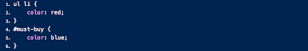

## Question A:

What color would you expect the item Sweet Halwa to show as and why?

## Question B:

What color would you expect the item "Sausage" to show as and why?

   

    

Hint: You need to view these images. To view them use one of the following techniques. These questions test your understanding of which of the competing CSS directives are used by the browser (cascading rules). You may read about these rules if you need a refresher.

- click on the preview button within VSCode (second icon from top right in VSCode; if you don't locate it, no sweat).
- view this question within github.com in the reviews repository shared with you.

### Answer A:
red - It is the second <li>, so it is even. It will not highlight blue.

### Answer B:
blue - It will match the last in the file, and the last match is the id selector #must-buy

### Feedback:
- **A** - The `nth-of-type` is going off of the things with a class of `highlight`. That `<li>` is the first (and only) element with that class, so it will end up being blue partially for that reason.
- **B** - It will be blue, but it has to do with the specificity and not necessarily the order.